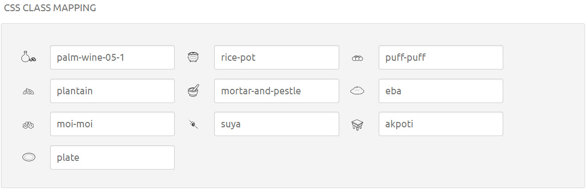

# food-icons
Repository for a custom food icon set (like font-awesome).

It contains common Nigerian food-related icons. Feel free to contribute!

## How to use
- Download the zip file. You don't need to clone the repository unless you want to contribute.
- Copy the fonts into the fonts folder of your project.
- Copy `food-icon.css` into your css folder.
- Add the css to your html file's head: `<link href="css/food-icon.css" rel="stylesheet" type="text/css">`
- Add the icon in the class of a HTML element. Common elements are `<i></i>` and `

`.
- Add `fi-` in front of the icon name you want to add.
- It's as easy as typing `<i class="fi-palm-wine"></i>` anywhere in your HTML.

**Please note that the css file checks for the fonts in your `fonts` folder. Please make sure you have one.

## How to contribute
Please contact me if you have any icon ideas, or any svgs of food items you'd like to add.
You can also clone the repo and submit a PR. 
I'll try my best to review all PRs, and add more icons.

Happy designing!